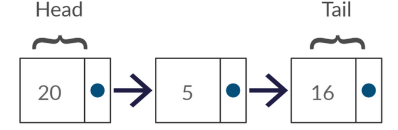
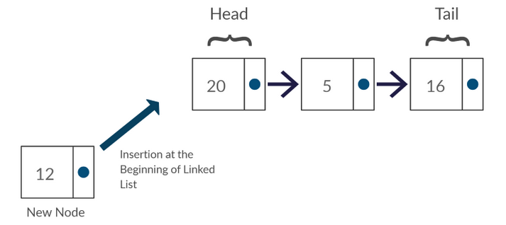
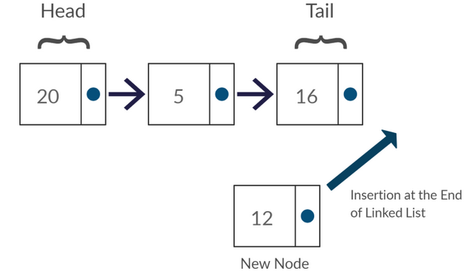
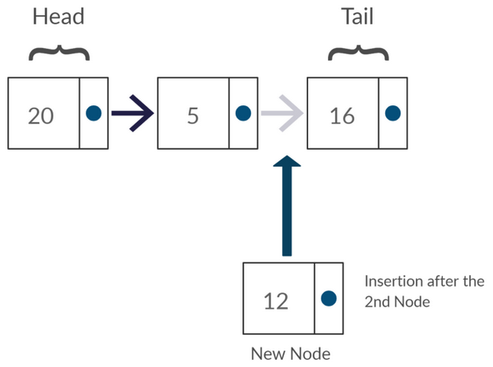
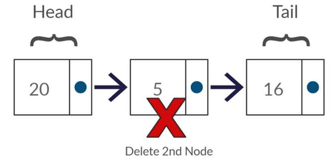

# LinkedList as data structure
<br>
A LinkedList is a data structure that represents a sequence of nodes.

-   In a singly linked list, each node points to the next node in the linked list.
-   In a doubly linked list, each node points to both the next node and the previous node

The following diagram depicts a singly linked list:


The following diagram depicts a doubly linked list:


<br>
Unlike an array, a linked list does not provide constant time access to a particular "index" within the list.
This means that if you'd like to find the Nth element in the list, you will need to iterate through N elements.

The benefit of a linked list is that you can add and remove items from the beginning og the list in constant time.
For specific application, this can be useful.

<br>

---
## The node
<br>

We have to initially create a class called `Node` and provide it with two attributes(properties) required by any node.

-  The data variable, in this case integer, were node data is stored.
-  The **next** variable of type Node, basically stores the _memory location_ of an object of type **Node**.

```java
//  package com.jetbrains;
public class Node {
    
    public  int     data;
    public  Node    next;

    public  Node(int data) {
        this.data   =   data;
        this.next   =   null;
    }
}
```

---


## The LinkedList implementation
<br>
There are 2 basically ways to implement it:

1. Creating a Node class and inside create the methods, for example `addToTail`
```java
//  package com.jetbrains;
public class Node{
    public  int     data;
    public  Node    next;

    public  Node(int newData){
        this.data   =   newData;
        this.next   =   null;
    }

    /**
     * @param newData   new data for the node to be added
     * 
     *                  Create a pointer that starts at the current node, so the head of the linked list;
     *                  Walk thorough the linked list until we get to the end of the linked list;
     *                      - we are not at the end of the linked list as long as there is something after;
     *                  Update the pointer created  -   keep moving to the end;
     *                  At the end, create this new node;
     *                      
     */
    
    public  void addToTail(int newData){
        Node currentNode  =  this;
        
        while(currentNode.next != null){
            currentNode = currentNode.next;
        }
        
        currentNode.next = new Node(newData);
    }
    
}
```
If we want to add and element into the front of LinkedList - we gonna actually change what the
`head node` is. This is a small **issue**: 

>What if multiple objects need a reference to the linked list, and then the head of the linked list changes? 
Some objects might still be pointing to the old head.

In this case the second solution is preferred
<br>
<br>

2.  Implement a `LinkedList` class that _wraps_ the `Node` class.This would essentially just have a single member variable: the head Node. 
    This would largely resolve the earlier issue.

```java
//  package com.jetbrains;
public class LinkedList{
    private Node    headNode;

    public  LinkedList(){
        this.headNode   =   null;
    }
    
    /**
     * @param newData   new data for the node to be added
     *
     *                  Create a pointer that starts/points at/to the head node, so the head of the linked list;
     *                  If we don't have a head -> create it and return;
     *                  Walk thorough the linked list until we get to the end of the linked list;
     *                      - we are not at the end of the linked list as long as there is something after;
     *                  Update the pointer created  -   keep moving to the end;
     *                  At the end, create this new node;
     *
     */

    public  void addToTail(int newData){
        if(this.headNode  ==  null){ 
            this.headNode = new Node(newData);
            return;
        }
        
        Node currentNode = this.headNode;
        
        while(currentNode.next != null){
            currentNode = currentNode.next;
        }

        currentNode.next = new Node(newData);
    }
    
    
}
```
---

<br>

| **_Average/Worst Case_** | Time Complexity | 
| ------ | ----------- |
| Access | O(n) |
| Search | O(n) |
| Insertion | O(1) or O(n) | 
| Deletion | O(1) or O(n)|

| | Space Complexity |
| ---- | ---- |
| Worst Case | O(n) |

<br>

### Basic Operations

1.   **Insertion**   - Adds an element in the linked list 
     -  insert a node at beginning
     -  insert a node at the end of list
     -  insert a node after a specified node
    

2.   **Deletion**    - Deletes an element from the linked list
     - delete the first node
     - delete the last node 
     - delete a node with a specified data
    

3.   **Traversing** or **Searching**
     - searching for data, by finding the node that contain the data wanted
     - traversing the linked list
     

<br>

#### Insertion
##### 1.1 insert a node at beginning

```java
/**
 * @param newData   new data for creating the new node
 *
 *                  Create a new node with the data passed as parameter
 *                  Set the new node created to point to the head of the list
 *                  Set the head of the list to be the new node added
 *
 */

public void insertNodeAtBeginning(int newData){
        Node newNode    =   new Node(newData);
        newNode.next    =   this.headNode; 
        this.headNode   =   newNode;     
}
```
<br>

##### 1.2 insert a node at the end of list

```java
/**
 * @param newData   new data for the node to be added
 *
 *                  If we don't have a head -> create it and return;
 *                  Create a pointer that starts/points at/to the head node, so the head of the linked list;
 *                  Walk thorough the linked list until we get to the end of the linked list;
 *                      - we are not at the end of the linked list as long as there is something after;
 *                  Update the pointer created  -   keep moving to the end;
 *                  At the end make the last node to point to new created node;
 *
 */
public void insertNodeAtEnd(int newData){
    if(this.headNode == null){
        this.headNode = new Node(newData);  
        return;
    }
    
    Node currentNode = this.headNode; 
    
    while(currentNode.next != null){  
            currentNode = currentNode.next; 
    }

    currentNode.next = new Node(newData);
}
```
<br>

##### 1.3   Insert a node after a specified node

```java
/**
 * @param newData   new data for the node to be added
 * @param prevNode  previous node after which we want to add the new node                 
 *
 *                  The prevNode cannot be null - return
 *                  Create the new node 
 *                  Set(link) the new node to (reference) point to the prevNode reference
 *                  Set(link) the prevNode to (reference) point to the new node inserted
 *
 */
public void insertValueAfterNode(Node prevNode, int newData){
        if(prevNode.next == null){    
            System.out.println("The given previous node cannot be null");  
            return;
        }

        Node newNode    =   new Node(newData);
        newNode.next    =   prevNode.next; 
        prevNode.next   =   newNode;
}
```
<br>


#### Deletion
##### 2.1   Delete the first node
```java
/**
 *
 *                  If head is null - list is empty - return
 *                  Set the head to be the next node after the head
 *
 */
public void deleteHead(){
    if(this.headNode == null){
        System.out.println("List is empty");
        return
    }
    
    this.head = this.head.next;
}
```
<br>

##### 2.2   Delete the last node
```java
/**
 *
 *                  If head is null - list is empty - return
 *                  Create a pointer that starts/points at/to the head node, so the head of the linked list;
 *                  Walk thorough the linked list until we get to the end of the linked list;
 *                      -   we are not at the end of the linked list as long as there is something after;
 *                  Set(link) the penultimate node to point to null;
 *
 *
 */
public void deleteTail(){
    if(this.headNode == null){
        System.out.println("List is empty");
        return;
    }

    Node currentNode = this.headNode;
    while(currentNode.next.next != null){
        currentNode = currentNode.next;
    }
    
    currentNode.next = null;
}
```
<br>

##### 2.3   Delete a node with a specified data

```java
/**
 * @param dataToDelete   data wanted to delete from the list
 *
 *                  If head is null - list is empty - return
 *                  Special Case:   Check if we want to delete the actual head of the list
 *                  Create a pointer that starts/points at/to the head node, so the head of the linked list;
 *                  Walk thorough the linked list until we get to the end of the linked list;
 *                       -  we are not at the end of the linked list as long as there is something after;
 *                  If the value found at the node is the data we want to delete make the reference to point to the next node;
 *                       -  walk around the data we want to delete - to exclude it from the list
 *
 */
public void deleteNodeByData(int dataToDelete){
    if(this.headNode == null) {
        return;
    }

    if (this.headNode.data == dataToDelete){ 
        this.headNode = this.headNode.next;
        return;
    }

    Node temp = this.headNode;                          

    while(temp.next != null){                          
        if(temp.next.data == dataToDelete){             
            temp.next = temp.next.next;                
            return;                        
        }
        temp = temp.next;                           
    }
}
```
<br>


#### Traversing or Searching
##### 3.1   Searching for data, by finding the node that contain the data wanted
```java
public Node searchFor(int dataToFind){
    if(this.headNode == null){
        System.out.println("LinkedList is empty");
        return null;
    }

    Node temp = this.headNode;
    while (temp != null){
        if(temp.data == dataToFind){
            System.out.println("Node found: " + "node adress: " + temp + "\t node data: " + temp.data);
            return temp;
        }
        temp = temp.next;
    }

    System.out.println("Value " + dataToFind + " not found...");
    return null;
}
```
<br>

##### 3.2   Traversing the linked list
```java
public void showList(){
    if(this.isEmpty()){
        System.out.println("Empty List");
    }
    System.out.print();

//  print the memory address of nodes  
    for(Node temp = this.headNode; temp != null; temp=temp.next){
        System.out.print(temp + "\t");
    }
    System.out.println();
    
//  print the data of nodes
    for(Node temp = this.headNode; temp != null; temp=temp.next){
        System.out.print(temp.data + "\t");
    }
    System.out.print();
}
```
---
<br>

### Other Useful Operations

-   Getters & Setters
    - set the head node
    - set the tail node
    - get the head node data
    - get the tail node data
    - get the size
    - check if empty
    - clear the list
    

-   Swap nodes
-   Return the middle node data
-   Delete the middle node    
-   The Nth last element of a singly linked list

<br>

####    Swap nodes
```java
public void  swapNodes(int data1, int data2){
    System.out.println("Swapping " + data1 + " with " + data2 + "\n");

    Node node1 = this.headNode;
    Node node2 = this.headNode;

    Node prevNode1 = null;
    Node prevNode2 = null;

    //  special_case:   if the elements are the same
    if(data1 == data2){
        System.out.println("Elements are the same, no swap is needed");
        return;
    }

    //  if elements are not the same        -   search for data1
    while(node1 != null){                   //  while node1 is not tail
        if(node1.data == data1){            //  if data matches
            break;                          //  data1 was found in list so break while loop
        }
                                                //  if data not found
        prevNode1 = node1;                  //  make prevNode = actual node (to keep track of prev pointer)
        node1 = node1.next;                 //  increment actual node
    }

    //  if elements are not the same        -   search for data2
    while(node2 != null){                   //  while node1 is not tail
        if(node2.data == data2){            //  if data matches
            break;                          //  data2 was found in list so break while loop
        }
                                                //  if data not found
        prevNode2 = node2;                  //  make prevNode = actual node (to keep track of prev pointer)
        node2 = node2.next;                 //  increment actual node
    }

    //  special_case:   no matching was found
    if(node1 == null || node2 == null){
        System.out.println("Swap not possible - one or more elements are not in the list");
        return;
    }

    //  Updating prevNode pointers
    if(prevNode1 == null){              //  check if prevNode is the head - if true node1 is head
        this.headNode = node2;          //  so make(update) node2 to be the head
    } else {
        prevNode1.next = node2;         //  set prevNode1.next to be the node2
    }

    if(prevNode2 == null){              //  check if prevNode is the head - if true node2 is head
        this.headNode = node1;          //  so make(update) node1 to be the head
    } else {
        prevNode2.next = node1;         //  set prevNode2.next to be the node1;
    }

    //  Updating next nodes pointers    -   simple basic swap;
    Node temp = node1.next;
    node1.next = node2.next;
    node2.next = temp;
}
```

<br>

####    Return the middle node data
```java
public int getMiddle(){
    /** Half Speed
     *
        int count = 0;
        Node fast = this.headNode;
        Node slow = this.headNode;

        while (fast != null){
            fast = fast.next;
            if (count % 2 != 0){
                slow = slow.next;
            }
            count++;
        }
        return slow.data;
     */
    
    Node fast = this.headNode;
    Node slow = this.headNode;

    while (fast != null){
        fast = fast.next;
        if(fast != null){
            fast = fast.next;
            slow = slow.next;
        }
    }
    return slow.data;
}
```

<br>

####    Delete the middle node
```java
//  a -> b -> c     <->     a -> c 

public boolean deleteMiddle(Node n){
    if(n == null || n.next == null){
        return false;
    }

    Node nextNode = n.next;
    n.data = nextNode.data;
    n.next = nextNode.next;
    return true;
}
```

<br>

####    The Nth last element of a singly linked list
```java
public int findNthElement(int n){
/**
 *      METHOD A:   TC: O(n) & SC: O(n) - return the size - nth element from and array

    ArrayList<Node>   listOfElements  =   new ArrayList<Node>(0);
    Node currentNode = this.headNode;

    while(currentNode != null){
        listOfElements.add(currentNode);
        currentNode = currentNode.next;
    }
 
    return listOfElements.get(listOfElements.size() - n).data;
  */

/**
 *      METHOD B:   TC: O(n) & SC: O(1)

    Node temp = null;
    Node currnetNode = this.headNode;
    int count = 0;
    
    while(currnetNode != null){
        currnetNode = currnetNode.next;
            if(count >= n) {
                if (temp == null) {
                    temp = this.headNode;
                }
            temp = temp.next;
            }
        count++;
    }
    
    return temp.data;
 */

/**
 *       METHOD C:   TC: O(n) & SC: O(1)
 */

    Node p1 = this.headNode;
    Node p2 = this.headNode;

    //  Move p1 N nodes into the list
    for(int i=0; i<n; i++){
        if(p1 == null){
            return -1;    //  out of bounds
        }
        p1 = p1.next;
    }

    //  Move p1,p2 at same time
    //  when p1 will be at end, p2 will be at the right element
    while(p1 != null){
        p1 = p1.next;
        p2 = p2.next;
    }
    
    return p2.data;
}
```