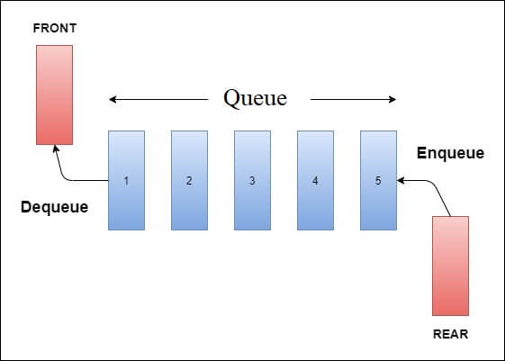
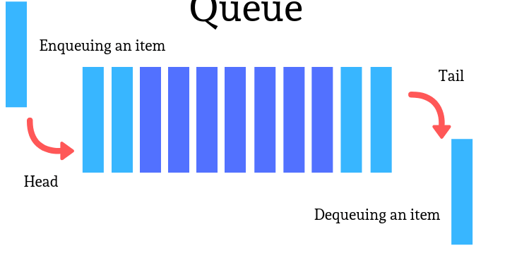

# Queue as data structure
<br>

A **Queue** is a linear data structure that follows the **FIFO** (Fast-In-First-Out) principle. 

-   Stack has one end 
-   Queue has two ends (front and rear). 

It contains **two pointers (head and tail)**, with head pointing to the topmost element of the queue and tail pointing to the tail element of the queue. 

Whenever an element is added in the queue, **it is added at the tail** of the queue, and the element can be deleted only from the head of queue.



<br>

---

## Queue implementation
<br>

```java
//  package com.jetbrains;
public final class Queue {
    private static class Node{
        private int data;
        private Node next;
        private Node(int data){
            this.data = data;
        }
    }

    private Node head;                  //  remove from the head
    private Node tail;                  //  add things here

    public Queue(){
        this.head = null;
        this.tail = null;
    }

    public final boolean isEmpty(){
        return this.head == null;
    }

    public final int peek(){
        return this.head.data;
    }

    public final void enqueue(final int data){      //  add to tail
        Node newNode = new Node(data);
        if(this.tail != null){
            this.tail.next = newNode;
        }
        this.tail = newNode;

        if(this.head == null){
            this.head = newNode;
        }
    }

    public final int dequeue(){                     //  remove from head
        int data = this.head.data;
        this.head = this.head.next;

        if(this.head == null){
            this.tail = null;
        }

        return data;
    }

    public final void print(){
        Node currentNode = this.head;
        while(currentNode != null){
            System.out.println(currentNode.data);
            currentNode = currentNode.next;
        }
    }

}
```
---

<br>

| **_Average/Worst Case_** | Time Complexity | 
| ------ | ----------- |
| Access | O(n) |
| Search | O(n) |
| Insertion | O(1) or O(n) | 
| Deletion | O(1) or O(n)|

<br>

### Standard Queue Operations

1.   **`isEmpty()`**   - Check if this queue is empty

2.   **`peek()`**    -  Looks at the object at the head of this queue without removing it

3.   **`enqueue(int item)`**   -   Add an item after tail of queue


     
4.   **`dequeue()`**    -   Removes an item from the head of the queue

6.   **`display()`**    -   It prints all the elements available in the queue  

<br>

