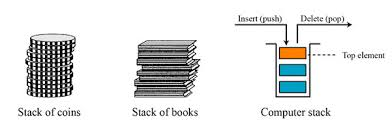
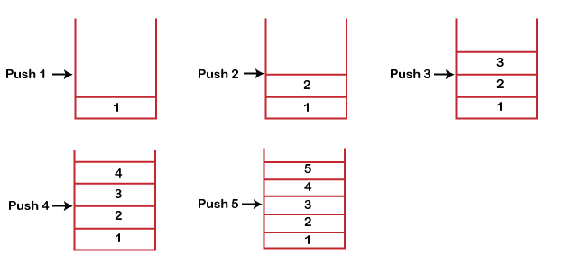
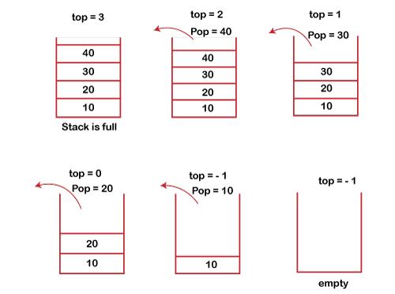

# Stack as data structure
<br>

A **Stack** is a linear data structure that follows the **LIFO** (Last-In-First-Out) principle. 

-   Stack has one end 
-   Queue has two ends (front and rear). 

It contains **only one pointer top pointer** pointing to the topmost element of the stack. 

Whenever an element is added in the stack, **it is added on the top** of the stack, and the element can be deleted only from the top of stack. 

In other words, a stack can be defined as a container in which insertion and deletion can be done from the one end known as the top of the stack.


<br>

---

## Stack implementation
<br>

Stack can be implemented using an `Node` class(basic implementation), an array or a linked list.

1. Stack basic implementation
```java
//  package com.jetbrains;
import java.util.EmptyStackException;

public final class Stack {

    private Node    top;
    private int     size;
    private final int     MAXSIZE;

    public  Stack(){
        this(Integer.MAX_VALUE);
    }

    public  Stack(int initSize){
        this.top    =   null;
        this.size   =   0;
        this.MAXSIZE = initSize;
    }
    

    public final boolean isEmpty(){
        return top == null;
    }

    public final int peek() throws EmptyStackException{
        if(this.isEmpty()){
            throw new EmptyStackException();
        }
        return this.top.data;
    }

    public final void push(final int data) throws OutOfMemoryError{
        if(this.size >= this.MAXSIZE){
            throw new OutOfMemoryError();
        }

        Node newNode =  new Node(data);
        newNode.next =  this.top;
        this.top     =  newNode;
        this.size++;
    }

    public final int pop()  throws EmptyStackException{
        if(!isEmpty()){
            int data = top.data;
            top = top.next;
            this.size--;
            return data;
        } else {
            throw new EmptyStackException();
        }
    }

    public final int getSize(){
        return this.size;
    }

    public void display(){
        Node currentNode = this.top;
        while(currentNode != null){
            System.out.println(currentNode.data);
            currentNode = currentNode.next;
        }
    }

}
```

<br>

2.  Stack implementation using basic arrays

```java
//  package com.jetbrains;
public final class StackArr {
    private final int maxSize = 1000;
    private int top;
    private final int[] stack;


    public StackArr(){
        this.top = -1;
        this.stack = new int[maxSize];
    }

    public final boolean isEmpty(){
        return  this.top < 0;
    }

    public final void push(final int x){
        this.top++;
        this.stack[this.top] = x;       // this.stack[++this.top] = x;
        System.out.println(x + " pushed into the stack");
    }

    public final int pop() throws  ArrayIndexOutOfBoundsException{
        if(this.top < 0){
            throw new ArrayIndexOutOfBoundsException();
        }
        this.top--;
        return this.stack[this.top];
    }

    public final int peek(){
        return this.stack[top];
    }

    public final void display(){
        for(int i=top; i>=0; i--){
            System.out.println(this.stack[i]);
        }
    }

    public final int getSize(){
        int nrOfElements = 0;
        for(int i=0;i<=top;i++){
            nrOfElements++;
        }
        return nrOfElements;
    }

}
```
---

<br>

| **_Average/Worst Case_** | Time Complexity | 
| ------ | ----------- |
| Access | O(n) |
| Search | O(n) |
| Insertion | O(1) | 
| Deletion | O(1) |

<br>

### Standard Stack Operations

1.   **`isEmpty()`**   - Check if this stack is empty

2.   **`peek()`**    -  Looks at the object at the top of this stack without removing it from the stack

3.   **`push(int item)`**   -   Pushes an item onto the top of this stack

     

4.   **`pop()`**    -   Removes the object at the top of this stack and returns that object as the value of this function

     

5.   **`count()`**  -   It returns the total number of elements available in a stack

6.   **`display()`**    -   It prints all the elements available in the stack  

<br>

